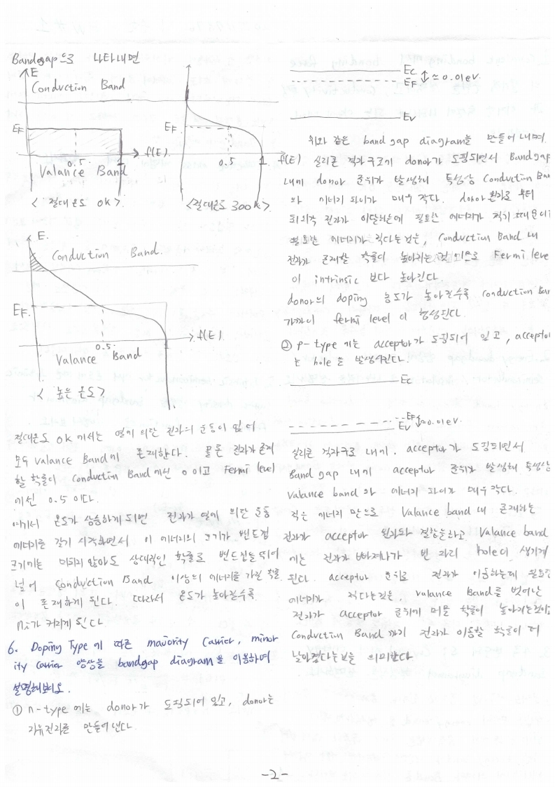

# HW1

전자소자 (김학린)

HW#1 (03/16, 월요일) - (제출마감일 : 3/28 토요일)

1. Covalent bonding에서 bonding force의 물리적 근원을 설명하고, conductivity 특성과 이러한 특성이 나타나게 되는 이유에 대하여 설명하시오.

2. Energy bandgap 양상에 따라서 conductor/semiconductor/insulator로 나누어짐을 설명하시오.

3. 4족 반도체 Si crystal에서 energy bandgap diagram이 형성됨을 설명하시오.

4. Effective mass 개념에 대해 설명하시오.

5. Intrinsic semiconductor에서 온도에 따른 intrinsic carrier density 양상을 bandgap diagram과 Fermi-Dirac function으로 설명해 보시오.

6. Doping type에 따른 majority carrier, minority carrier 양상을 bandgap diagram을 이용하여 설명해 보시오.

7. N type doping된 반도체에서 온도 조건에 따라 carrier density 변화 양상을 energy bandgap diagram과 Fermi-Dirac distibution 함수로 설명해 보시오.

8. Mobility에 대해 설명해 보시오.

9. Drift current와 diffusion current에 대해 수식적으로/개념적으로 설명해 보시오.

10. PN접합 diode에서 bias 조건에 따른 carrier의 flux 양상과 current 양상을 drift 성분과ndiffusion 성분, 그리고 net 성분으로 설명해 보시오. (bandgap diagram의 변화와 함께 quisi-Fermi level 변화를 같이 그려가면서 정성적으로 설명바람)

11. PN 접합 diode에서 built-in potential이 존재함을 설명하시오. Doping density에 따른 Depletion width에 대해 구해 보시오.

12. Ideal diode equation을 유도하시오.

13. Quasi-Fermi level에 대해 설명해 보시오.

14. MS contact에서 work function 관계에 따라 Schottky contact과 Ohmic contact이 나타남을 bandgap diagram을 통해 설명하시오.

15. Vaccum level, electron affinity, work function 개념에 대해 정의하시오.

    HW은 자필로 작성하여 제출바람

