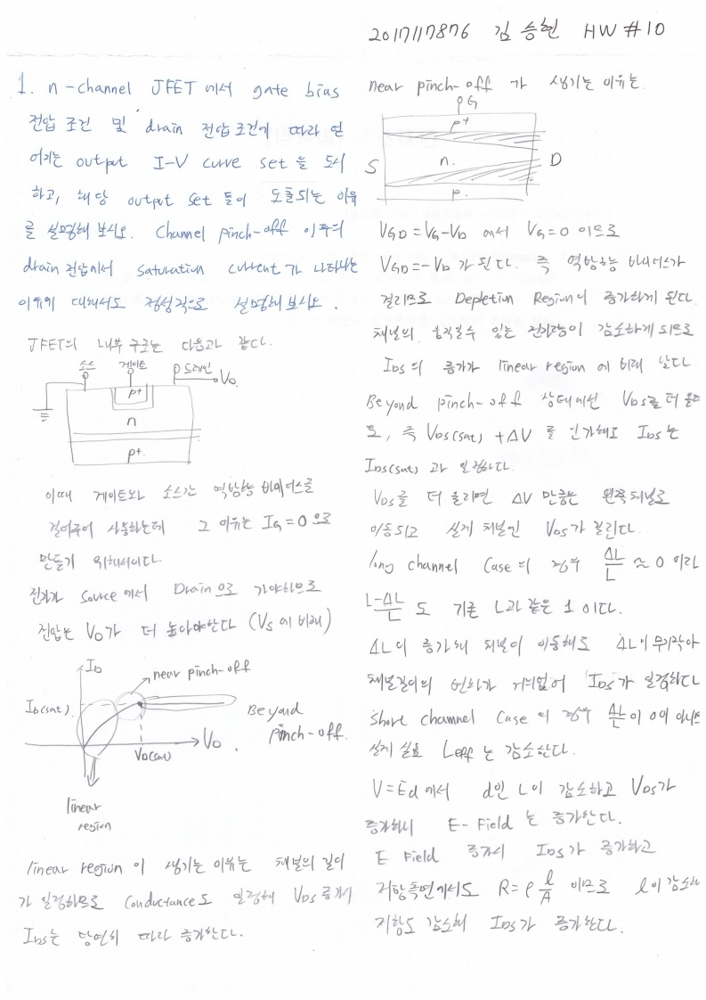

# HW10

전자소자 (김학린)

HW#10 (04/15, 수요일) - (제출마감일 : 4/21 화요일)

1. n-channel JFET에서 gate bias 전압 조건 및 drain 전압 조건에 따라 얻어지는output I-V curve set을 도시하고, 해당 output curve set들이 도출되는 이유를 설명해 보시오. Channel pinch-off 이후의 drain 전압에서 saturation current가 나타나는 이유에 대해서도 정성적으로 설명해 보시오.

