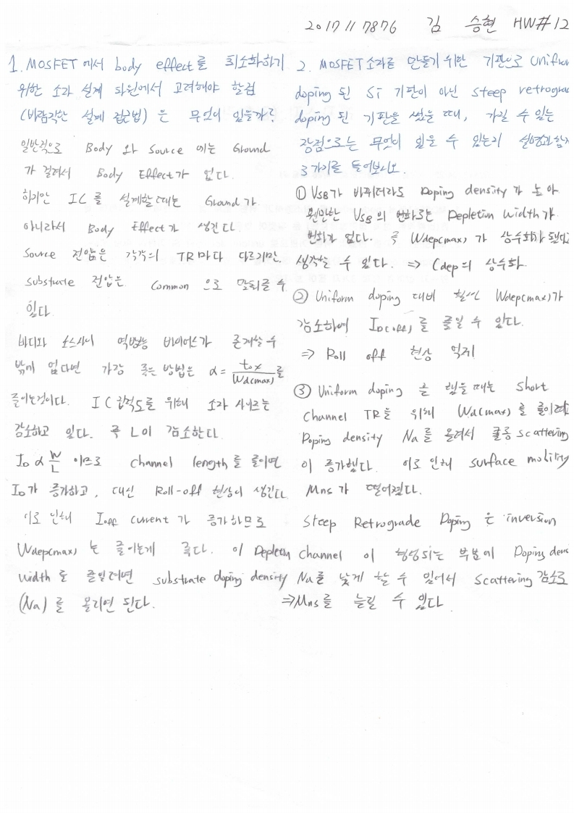

# HW12

전자소자 (김학린)

HW#12 (04/22, 수요일) - (제출마감일 : 4/28 화요일)

1. MOSFET에서 body effect를 최소화하기 위한 소자 설계 차원에서 고려해야 할점(바람직한 설계 접근법으로는) 은 무엇이 있을 수 있을까?

2. MOSFET 소자를 만들기 위한 기판으로 uniform doping된 Si 기판이 아닌 steep retrograde doping된 기판을 썼을 때, 가질 수 있는 장점으로는 무엇이 있을 수 있는지 설명과 함께 3가지 들어 보시오.

