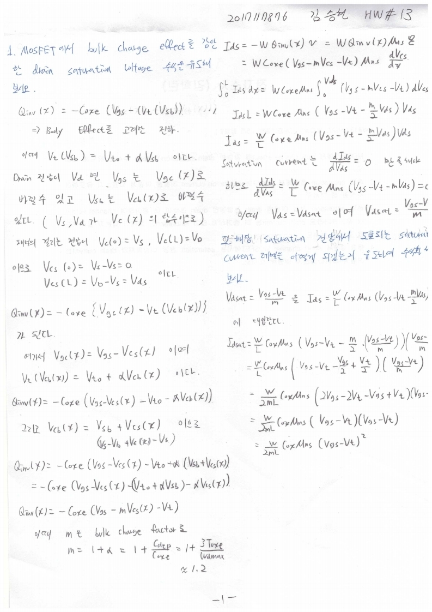
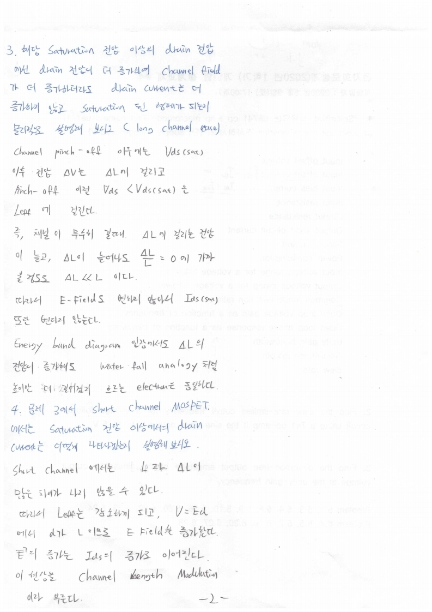

# HW13

전자소자 (김학린)

HW#13 (04/27, 월요일) - (제출마감일 : 5/3 일요일)

1. MOSFET에서 bulk charge effect를 감안한 drain saturation voltage 수식을 유도해 보시오.

2. 해당 saturation 전압에서 도출되는 saturation current 레벨은 어떻게 되겠는지 유도하여수식화 해 보시오.

3. 해당 saturation 전압 이상의 drain 전압에선 drain 전압이 더 증가하여 channel field가더 증가하더라도 drain current는 더 증가하지 않고 saturation된 형태가 되는지 물리적으로 설명해 보시오. (long channel case)

4. 문제 3에서 short channel MOSFET에서는 saturation 전압 이상에서의 drain current는 어떻게 나타나겠는지 설명해 보시오.

