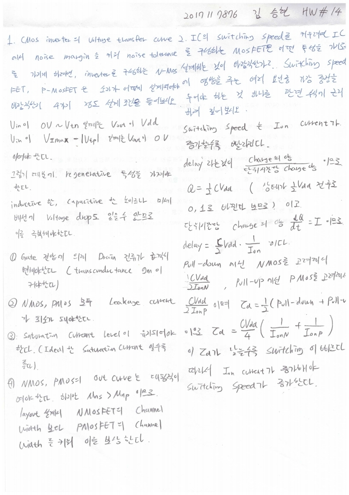
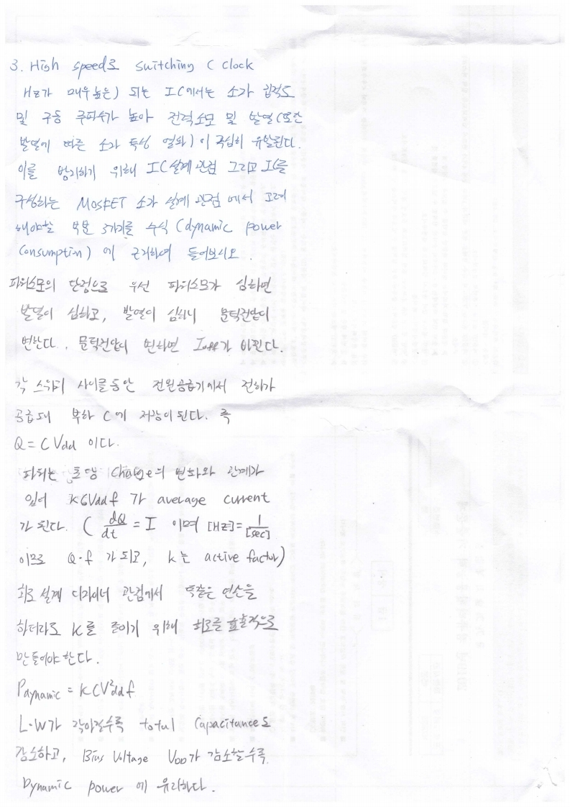

# HW14

전자소자 (김학린)

HW#14 (04/29, 수요일) - (제출마감일 : 5/5 화요일)

1. CMOS inverter의 voltage transfer curve에서 noise margin을 키워 noise tolerance를 가지게 하려면, inverter를 구성하는 N-MOSFET 및 P-MOSFET은 소자가 어떻게 설계되어야 바람직한지 4가지 정도 설계조건을 들어 보시오.

2. IC의 switching speed를 키우려면 IC를 구성하는 MOSFET은 어떤 특성을 가지도록 설계하는 것이 바람직한가? Switching speed에 영향을 주는 여러 요인 중 가장 중점을 두어야 하는 것 하나를 관련 수식에 근거하여 짚어 보시오.

3. High speed로 switching (clock Hz가 매우 높은)되는 IC에서는 소자 집적도 및 구동 주파수가 높아 전력소모 및 발열(또한 발열에 따른 소자 특성 열화)이 극심히 유발된다. 이를 방지하기 위해 IC 설계 관점 그리고 IC를 구성하는 MOSFET 소자 설계 관점에서 고려해야 할 부분 3가지를 수식(dynamic power consumption)에 근거하여 들어보시오.

