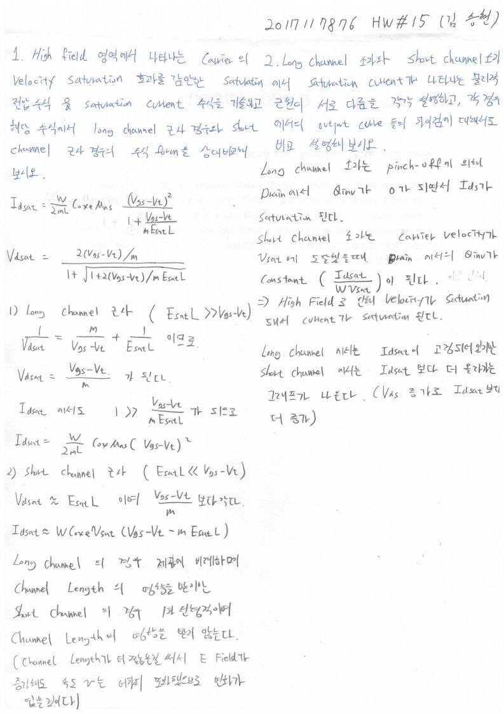

# HW15

전자소자 (김학린)

HW#15 (05/04, 월요일) - (제출마감일 : 5/10 일요일)

1. High field 영역에서 나타나는 carrier의 velocity saturation 효과를 감안한 saturation 전압 수식 & saturation current 수식을 기술하고, 해당 수식에서 long channel 근사 경우와 short channel 근사 경우의 수식 form을 상대 비교해 보시오.

2. Long channel 소자와 short channel 소자에서 saturation current가 나타나는 물리적 근원이 서로 다름을 각각 설명하고, 각 경우에서의 output curve들의 차이점에 대해서도 비교 설명해 보시오.

