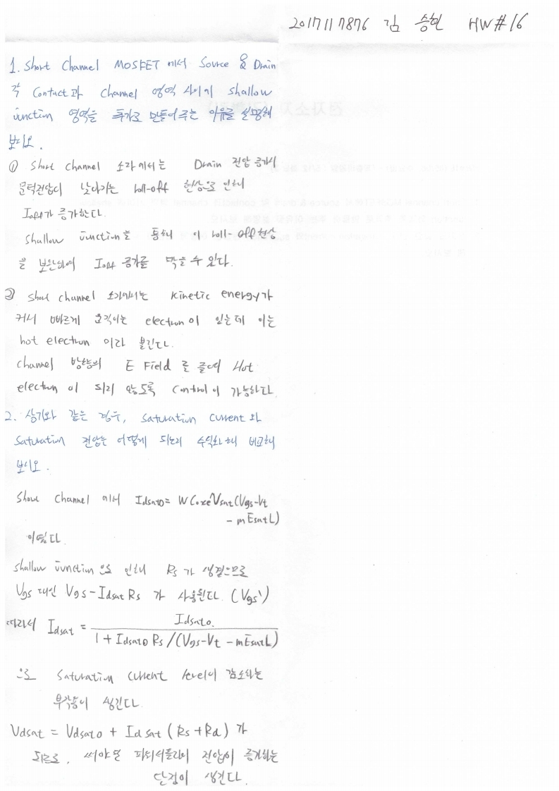

# HW16

전자소자 (김학린)

HW#16 (05/06, 수요일) - (제출마감일 : 5/12 화요일)

1. Short channel MOSFET에서 source & drain 각 contact과 channel 영역 사이에 shallow junction 영역을 추가로 만들어 주는 이유를 설명해 보시오.

2. 상기와 같은 경우, saturation current와 saturation 전압은 어떻게 되는지 수식화해 비교해 보시오.

