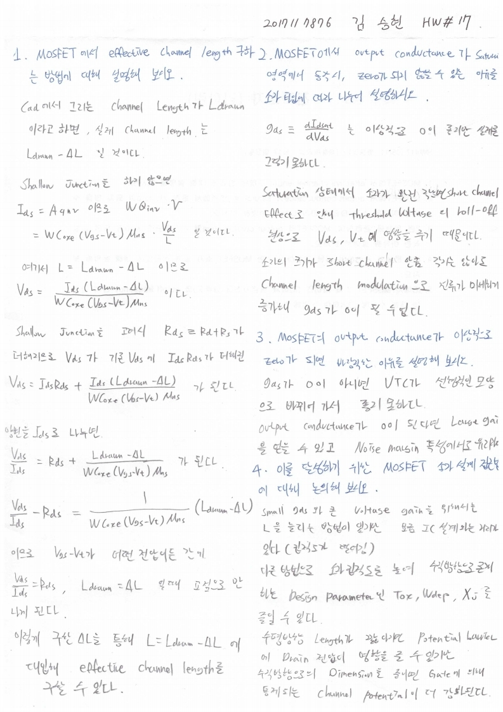
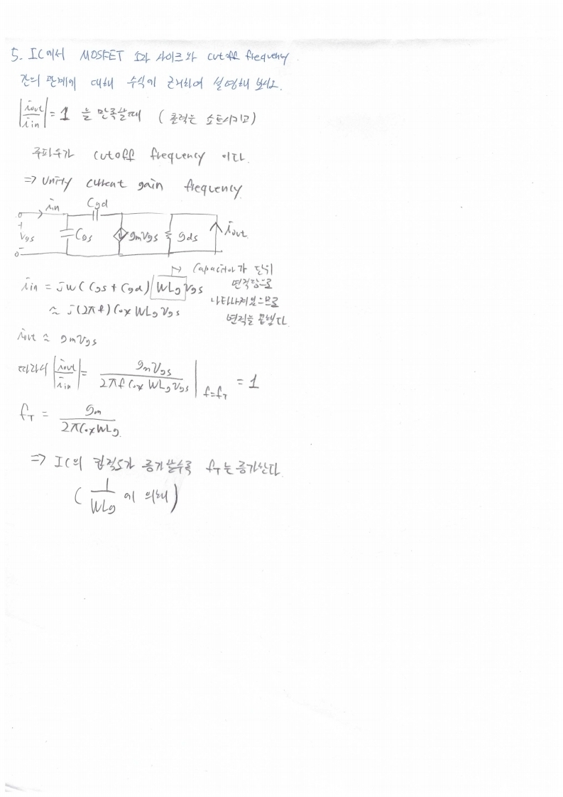

# HW17

전자소자 (김학린)

HW#17 (05/11, 월요일) - (제출마감일 : 5/17 일요일)

1. MOSFET에서 effective channel length 구하는 방법에 대해 설명해 보시오.

2. MOSFET에서 output conductance가 saturation 영역에서 동작 시, zero가 되지 않을 수 있는 이유를 소자 타입에 따라 나누어 설명해 보시오.

3. 2번 문제와 관련하여, MOSFET의 output conductance가 이상적으로 zero가 되면 바람직한 이유를 설명해 보시오.

4. 3번 문제와 관련하여 이를 달성하기 위한 MOSFET 소자 설계 접근법에 대해 논의해 보시오.

5. IC에서 MOSFET 소자 사이즈 (IC에서 트랜지스터 집적도)와 cutoff frequency 간의 관계에 대해 수식에 근거하여 논의해 보시오.

