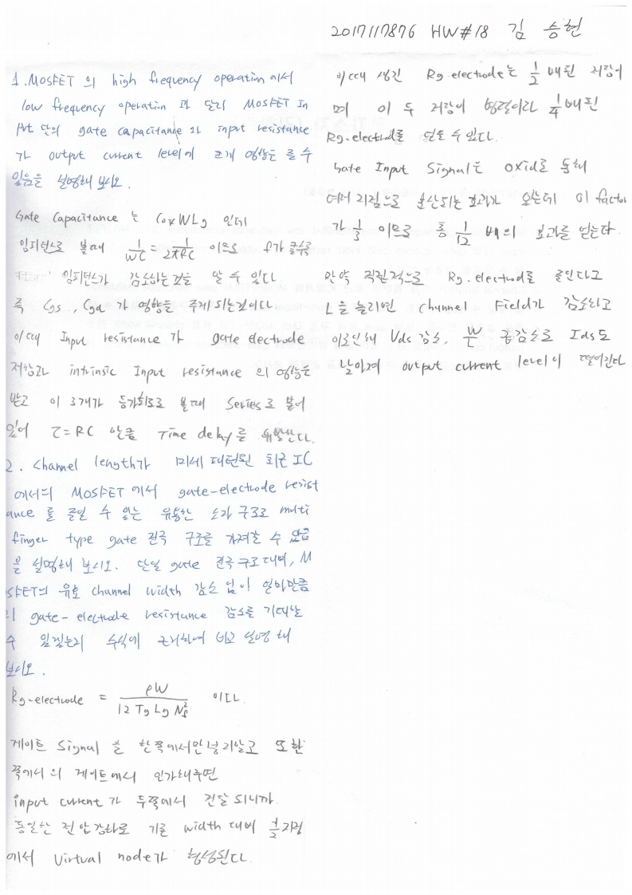

# HW18

전자소자 (김학린)

HW#18 (05/13, 수요일) - (제출마감일 : 5/19 화요일)

1. MOSFET의 high frequency operation에서 low frequency operation과 달리 MOSFET input 단의 gate capacitance와 input resistance가 output current level에 크게 영향을 줄 수 있음을 설명해 보시오.

2. Channel length가 미세 패턴된 최근 IC에서의 MOSFET에서 gate-electrode resistance 를 줄일 수 있는 유용한 소자 구조로 multi-finger type gate 전극 구조를 가져갈 수 있음을 설명해 보시오. 단일 gate 전극 구조 대비, MOSFET의 유효 channel width 감소 (output current level의 감소 없이)없이 얼마만큼의 gate-electrode resistance 감소를 기대할 수 있겠는지 수식에 근거하여 비교 설명해 보시오.

