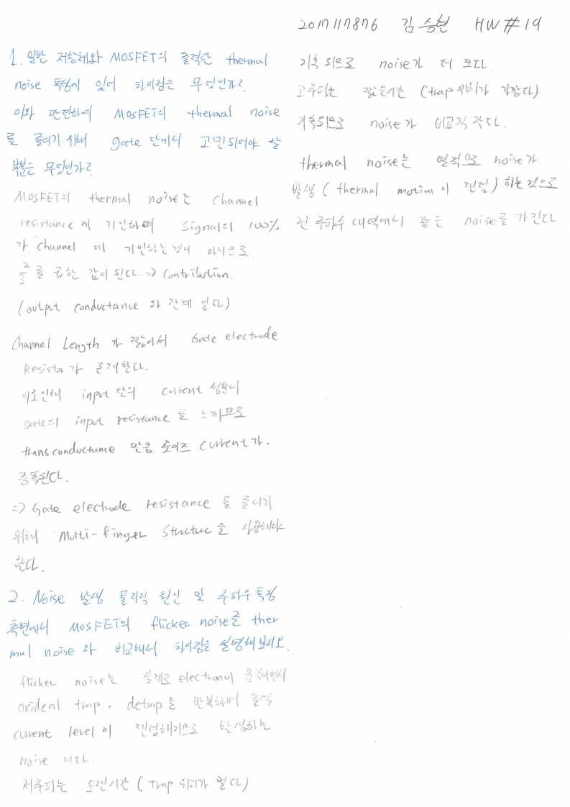

# HW19

전자소자 (김학린)

HW#19 (05/18, 월요일) - (제출마감일 : 5/24 일요일)

1. 일반 저항체와 MOSFET의 출력단 thermal noise 특성에 있어 차이점은 무엇인가? 이와관련하여 MOSFET의 thermal noise를 줄이기 위해 gate단에서 고민되어야 할 부분은 무엇인가?

2. Noise 발생 물리적 원인 및 주파수 특징 측면에서 MOSFET의 flicker noise를 thermal noise와 비교해서 차이점을 설명해 보시오.

