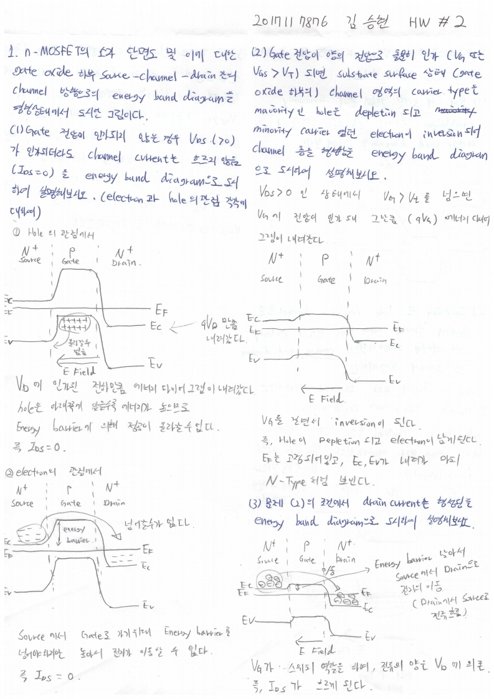
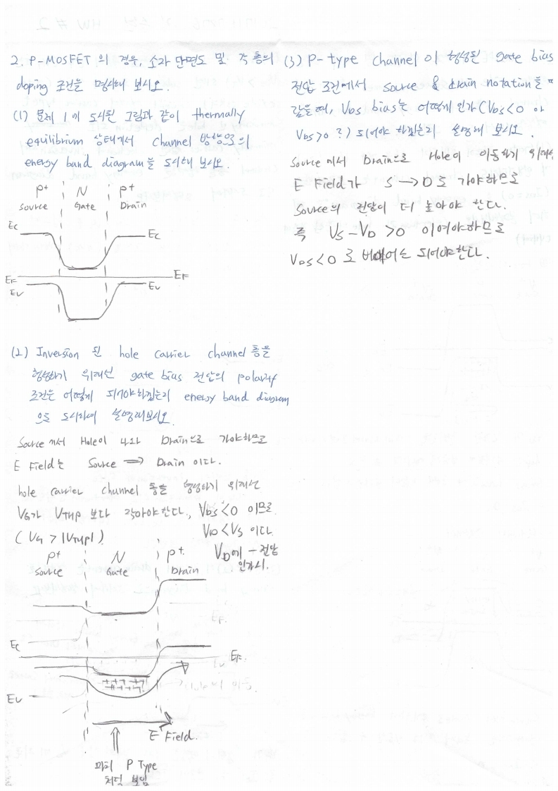

# HW2

> 전자소자 (김학린) HW#1 (03/18, 수요일) - (제출마감일 : 3/28 토요일)

1. 위 그림은 n-MOSFET의 소자 단면도 및 이에 대한 gate oxide 하부 source-channel-drain 간의 channel 방향으로의 energy band diagram을 평형 상태에서 도시한 그림이다.

   (1) Gate 전압이 인가되지 않은 경우, VDS (>0)가 인가되더라도 channel current는 흐르지않음(IDS=0)을 energy band diagram으로 도시하여 설명해 보시오. (electron current &hole current 각각의 관점에서 논의해 보길 바람)

   (2) Gate 전압이 양의 전압으로 충분히 인가(VG 또는 VGS > VT)되면 substrate surface 상의 (gate oxide 하부의) channel 영역의 carrier type은 majority carrier인 hole은 depletion되고 minority carrier였던 electron이 inversion되어 channel 층을 형성함을 energy banddiagram으로 도시하여 설명해 보시오.

   (3) 문제 (2)의 조건에서 drain current는 형성됨을 energy band diagram으로 도시하여 설명해 보시오.

2. 위 그림은 p-MOSFET의 경우, 소자 단면도 및 각 층의 doping 조건을 명시해 보시오.

   (1) 문제 1에 도시된 그림과 같이 thermally equilibrium 상태에서의 channel 방향으로의energy band diagram을 도시해 보시오.

   (2) Inversion된 hole carrier channel층을 형성하기 위해선 gate bias 전압의 polarity 조건은 어떻게 되어야하겠는지 energy band diagram으로 도시하여 설명해 보시오.

   (3) p-type channel이 형성된 gate bias 전압 조건에서 source & drain notation을 따랐을때, VDS bias는 어떻게 인가(VDS<0 or VDS >0 ?)되어야 하겠는지 설명해 보시오.

   HW은 자필로 작성하여 기한 내 제출바람

