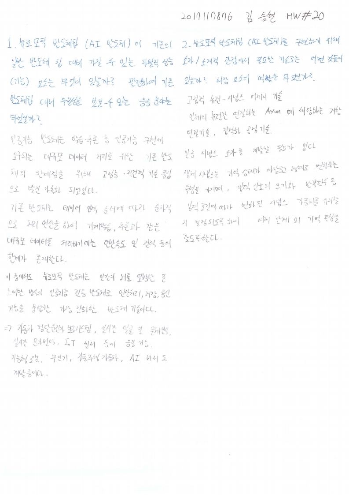

# HW20

전자소자 (김학린)

HW#20 (05/20, 수요일) - (제출마감일 : 5/26 화요일)

제공된 material을 읽고 다음 질문의 관점에서 정리하여 답하시오. (총 2 page 이내)

1. 뉴로모픽 반도체칩 (AI 반도체)이 기존의 일반 반도체칩 대비 가질 수 있는 차별적 성능 (기능) 요소는 무엇이 있을까? 관련하여 기존 반도체칩 대비 우월성을 보일 수 있는 응용 분야는 무엇일까?

2. 뉴로모픽 반도체칩 (AI 반도체) 구현을 위해 소자/소재적 관점에서 필요한 기술로는 어떤 것들이 있을까? 해당 요소의 역할은 무엇인가?

