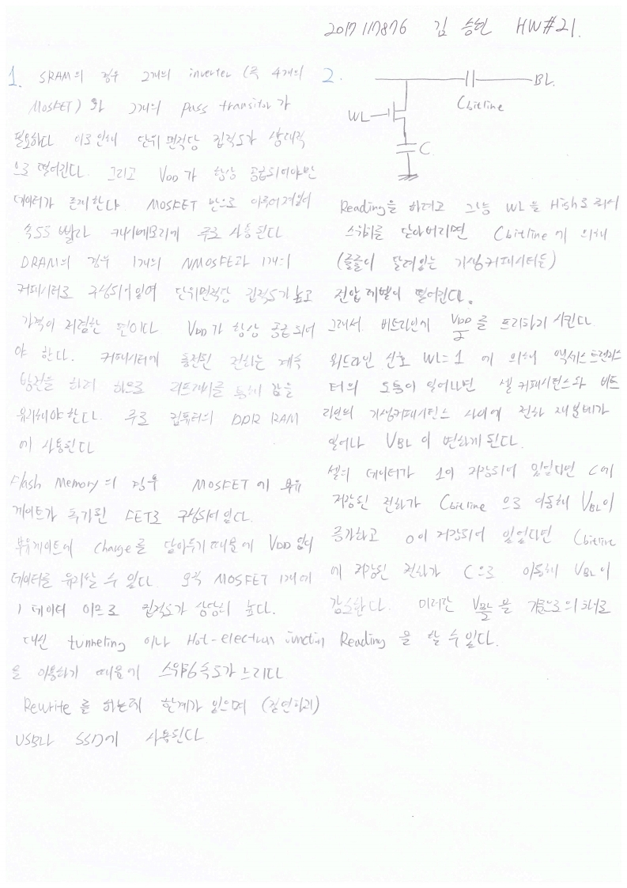

# HW21

> 전자소자 (김학린)HW#21 (05/25, 월요일) - (제출마감일 : 6/1 월요일)
>
> 1. 아래 표 상에 3가지 유형의 메모리 소자에 대한 상대 비교가 여러 관점에서 제시되어 있다. 각 항목의 비교 내용에 대해 각 소자 동작 원리 및 특성에 근거하여 설명해 보시오.
> 2. DRAM에서 bit line에 존재하는 bit-line capacitance를 감안하여 cell capacitance에 저장되어 있던 ‘1’ 또는 ‘0’ 전압(또는 charge) 타입을 판별하여 reading해 낼 수 있는 방법에 대해 회로 해석에 근거하여 설명해 보시오.

