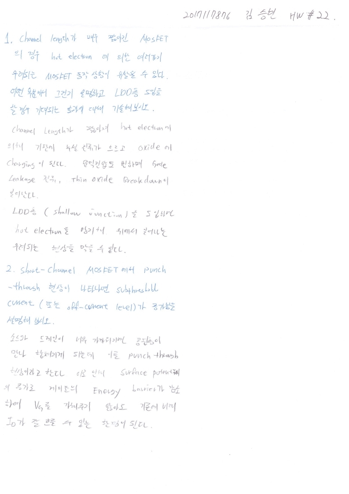

# HW22

전자소자 (김학린)

HW#22 (05/27, 수요일) - (제출마감일 : 6/3 수요일)

1. Channel length 매우 짧아진 MOSFET의 경우, hot electron에 의한 여러 가지 우려되는 MOSFET 동작 상황이 유발될 수 있다. 어떤 부분에서 그런지 설명하고 LDD 층 도입을 할 경우 기대되는 효과에 대해 기술해 보시오.

2. Short-channel MOSFET에서 punch-through 현상이 나타나면 subthreshold current (또는 off-current level)가 증가함을 설명해 보시오.

