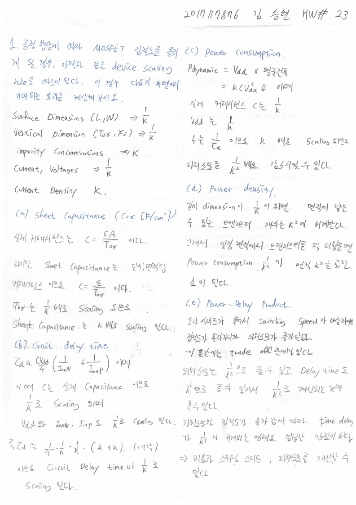

# HW23

전자소자 (김학린)

HW#23 (06/01, 월요일) - (제출마감일 : 6/8 월요일)

1. 공정 향상에 따라 MOSFET 집적도를 올리게 될 경우, 아래와 같은 device scaling rule을 따르게 된다. 이 경우, 다음의 측면에서 기대되는 효과를 계산해 보시오.

(a) sheet capacitance (Cox [F/cm2])

(b) circuit delay time

(c) power consumption

(d) power density (under consideration on the increased MOSFET integration density)

(e) power-delay product

