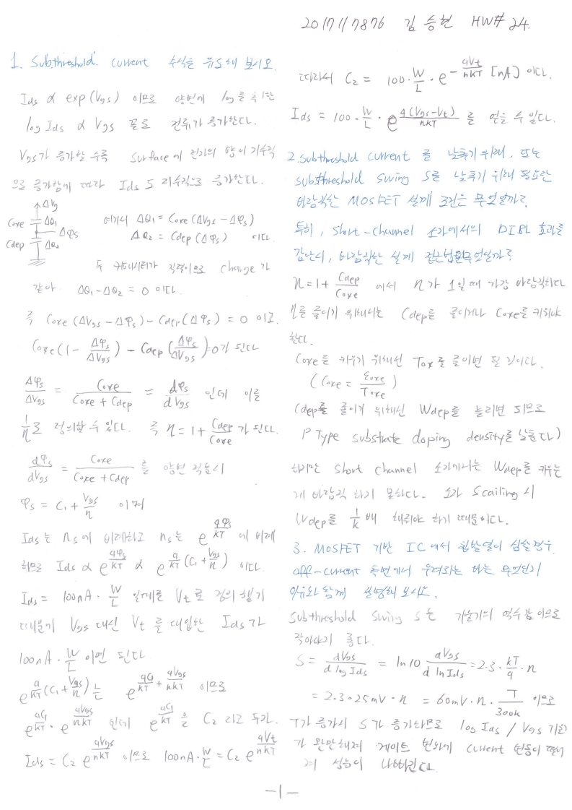
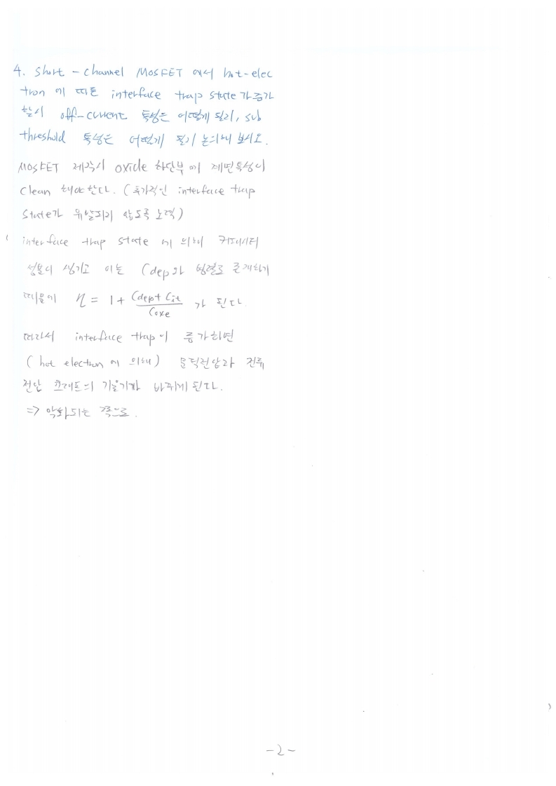

# HW24

전자소자 (김학린)

HW#24 (06/03, 수요일) - (제출마감일 : 6/10 수요일)

1. Subthreshold current 수식을 유도해 보시오.

2. Subthreshold current를 낮추기 위해, 또는 subthreshold swing S를 낮추기 위해 필요한 바람직한 MOSFET 설계 조건은 무엇일까? 특히, short-channel 소자에서의 DIBL 효과를 감안 시, 바람직한 접근법은 무엇일까?

3. MOSFET 기반 IC에서 칩발열이 심할 경우, off-current 측면에서 우려되는 바는 무엇인

   지, 이유와 함께 설명해 보시오.

4. Short-channel MOSFET에서 hot electron에 따른 interface trap state가 증가할 시, off-current 특성은 어떻게 될지, subthreshold 특성은 어떻게 될지 논의해 보시오.

