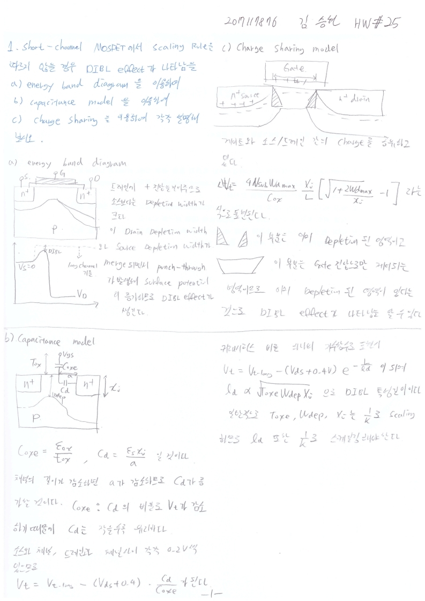
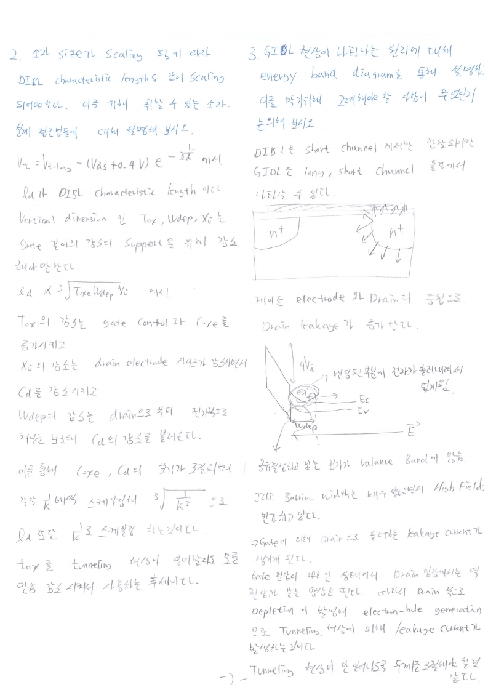

# HW25

전자소자 (김학린)

HW#25 (06/08, 월요일) - (제출마감일 : 6/15 월요일)

1. Short-channel MOSFET에서 scaling rule을 따르지 않을 경우, DIBL effect가 나타남을

   a) energy band diagram을 이용하여,

   b) capacitance model을 이용하여,

   c) charge sharing model을 이용하여 각각 설명해 보시오.

2. 소자 size가 scaling 됨에 따라 DIBL characteristic length도 같이 scaling 되어야 한다. 이를 위해 취할 수 있는 소자 설계 접근법들에 대해 설명해 보시오.

3. GIDL 현상이 나타나는 원리에 대해 energy band diagram을 통해 설명하고, 이를 막기 위해 고려해야 할 사항이 무엇인지 논의해 보시오.

