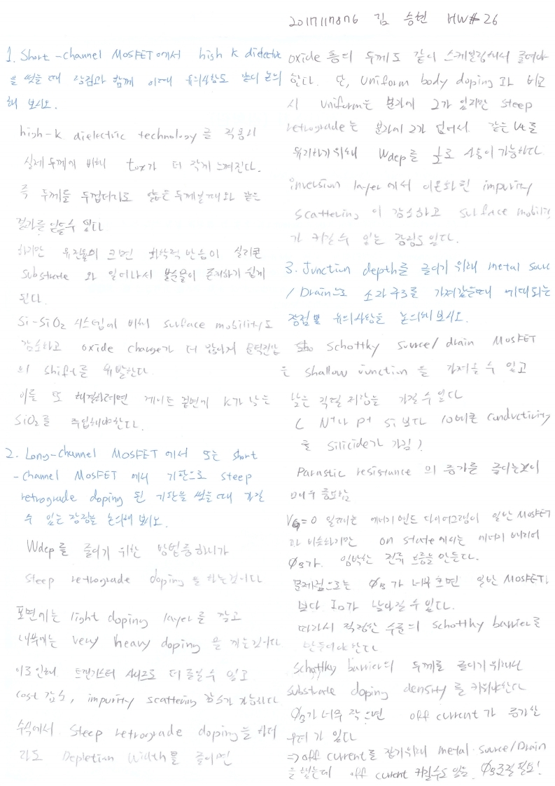

# HW26

> 전자소자 (김학린)HW#26 (06/10, 수요일) - (제출마감일 : 6/17 수요일)
>
> 1. Short-channel MOSFET에서 high K dielectric을 썼을 때 장점과 함께 이때 유의 사항도같이 논의해 보시오.
>
> 2. Long-channel MOSFET에서 또는 short-channel MOSFET에서 기판으로 steep retrograde doping된 기판을 썼을 때 가질 수 있는 장점에 대해 논의해 보시오.
>
> 3. Junction depth를 줄이기 위해 metal source/drain으로 소자 구조를 가져갔을 때, 기대되는 장점 및 유의 사항에 대해 논의해 보시오.

