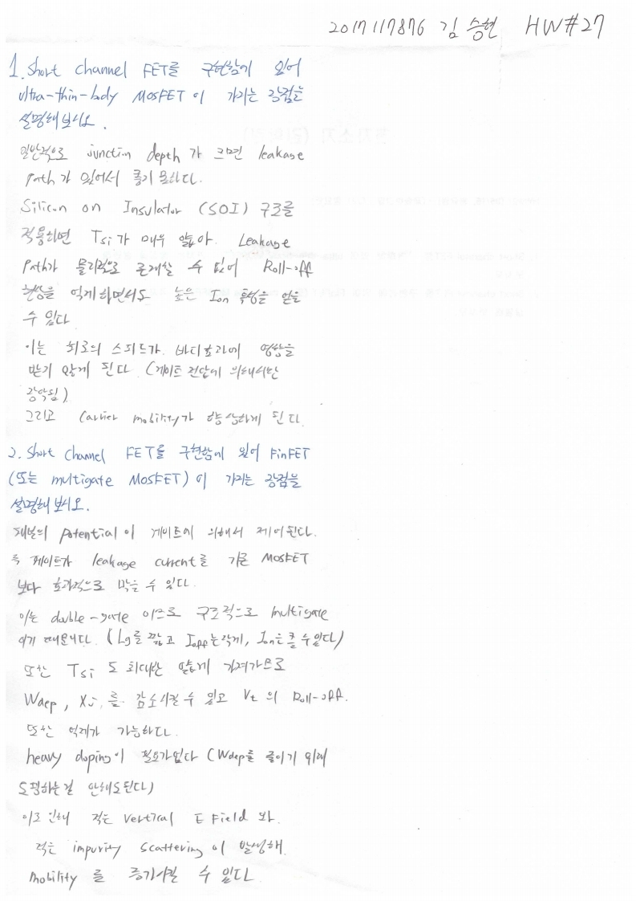

# HW27

전자소자 (김학린)

HW#27 (06/15, 월요일) - (제출마감일 : 6/21 일요일)

1. Short channel FET를 구현함에 있어 ultra-thin-body MOSFET이 가지는 장점을 설명해보시오.

2. Short channel FET를 구현함에 있어 FinFET (또는 multigate MOSFET)이 가지는 장점을 설명해 보시오.

