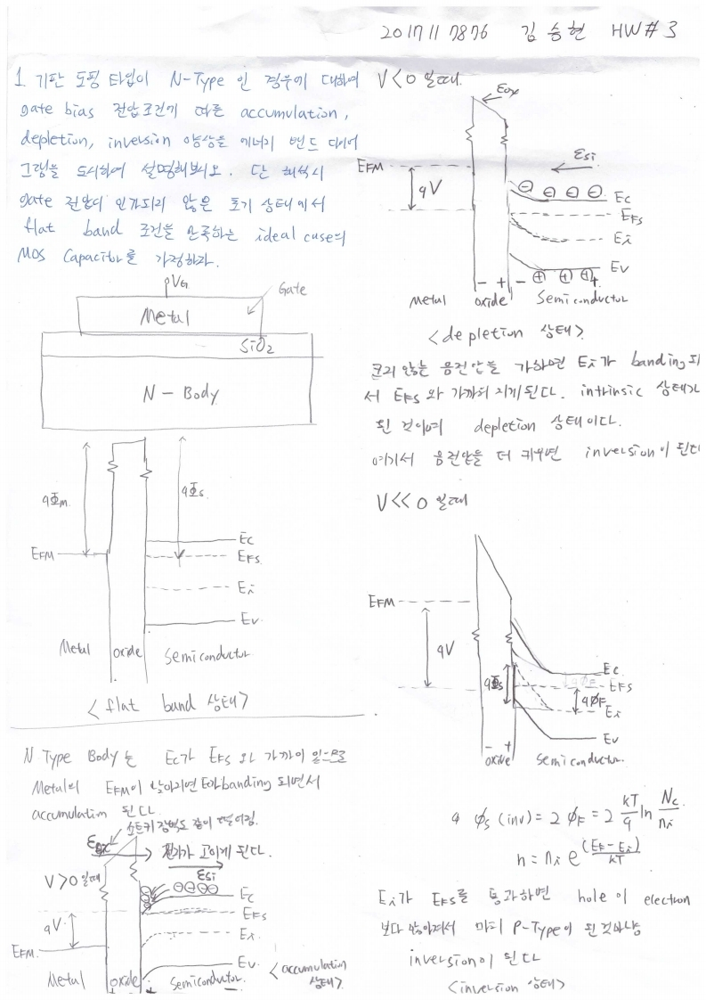

# HW3

> 전자소자 (김학린)HW#3 (03/23, 월요일) - (제출마감일 : 3/29 일요일)이전 HW들은 수강 정정 기간 학생들을 고려하여 HW 제출 기한이다소 여유 있게 잡혀 있었습니다만,향후 HW들은 1주일 이내 제출로 본부 가이드를 따르니 제출 기한에 유의 바랍니다.

1. 상기 MOS capacitor 구조에 대하여 수업 시간에 Si substrate가 p-type 도핑된 경

우에 대하여 gate bias 전압에 따른 gate oxide 하부 Si에서의 accumulation,

depletion, inversion 동작 특성에 대하여 배웠다. 기판 도핑 타입이 n-type인 경우

에 대하여, gate bias 전압 조건에 따른 accumulation, depletion, inversion 양상을

에너지 밴드 다이어그램을 도시하여 설명해 보시오. 단, 해석 시, gate 전압이 인가

되지 않은 초기 상태에서 flat band 조건을 만족하는 ideal case의 MOS capacitor

를 가정하자.

