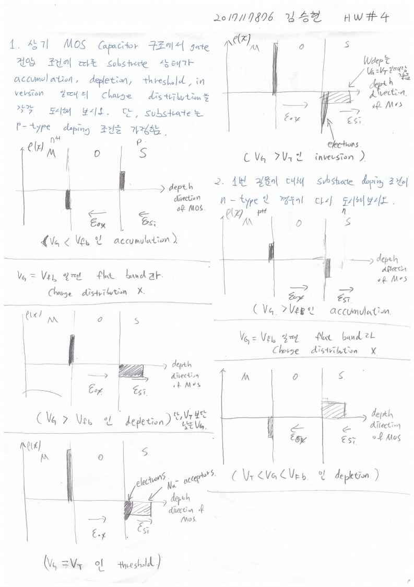

# HW4

> 전자소자 (김학린)HW#4 (03/25, 수요일) - (제출마감일 : 3/31 화요일)이전 HW들은 수강 정정 기간 학생들을 고려하여 HW 제출 기한이다소 여유 있게 잡혀 있었습니다만,향후 HW들은 1주일 이내 제출로 본부 가이드를 따르니 제출 기한에 유의 바랍니다.

1. 상기 MOS capacitor 구조에서 gate 전압 조건에 따른 substrate 상태가accumulation, depletion, threshold, inversion 일 때의 charge distribution을 각각 도시해 보시오. 단, substrate는 p-type doping 조건을 가정함.

2. 1번 질문에 대해 substrate doping 조건이 n-type인 경우에 대해 다시 도시해 보시오.

