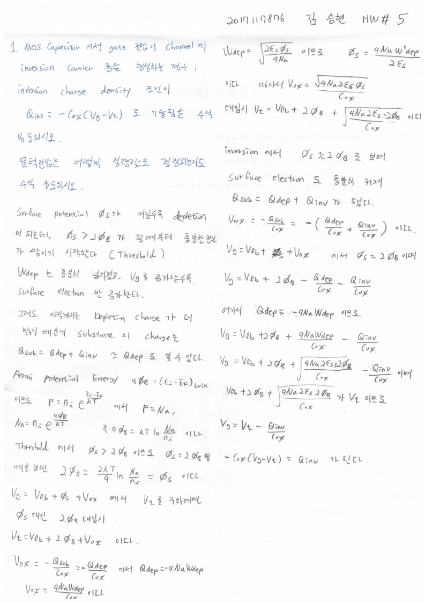

# HW5

> 전자소자 (김학린)HW#5 (03/30, 월요일) - (제출마감일 : 4/5 일요일)이전 HW들은 수강 정정 기간 학생들을 고려하여 HW 제출 기한이다소 여유 있게 잡혀 있었습니다만,향후 HW들은 1주일 이내 제출로 본부 가이드를 따르니 제출 기한에 유의 바랍니다.

1. MOS capacitor에서 gate 전압이 channel에 inversion carrier 층을 형성하는 경우,

inversion charge density 조건이 다음과 같이 기술됨을 수식 유도하시오. 문턱전압

은 어떻게 정량적으로 결정되는지도 수식 유도하시오.

(수업시간 내용에 대한 단순 복습임. 수식 전개 과정을 복습으로 직접 써 가면서 한

번 따라가 봅시다.)

