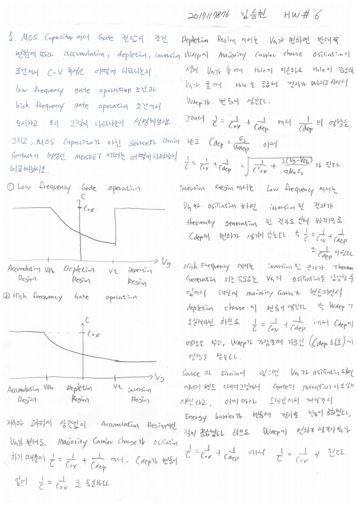

# HW6

> 전자소자 (김학린)HW#6 (04/01, 수요일) - (제출마감일 : 4/7 화요일)이전 HW들은 수강 정정 기간 학생들을 고려하여 HW 제출 기한이다소 여유 있게 잡혀 있었습니다만,향후 HW들은 1주일 이내 제출로 본부 가이드를 따르니 제출 기한에 유의 바랍니다.

1. MOS capacitor에서 gate 전압이 조건 변함에 따라 accumulation, depletion,

inversion 조건에서 C-V 특성은 어떻게 나타나는지 low frequency gate operation

조건과 high frequency gate operation 조건에서 도시하고, 왜 그렇게 나타나는지

설명해 보시오. 그리고, MOS capacitor가 아닌 source와 drain contact이 형성된

MOSFET에서는 어떻게 나타날지 비교해 보시오.

