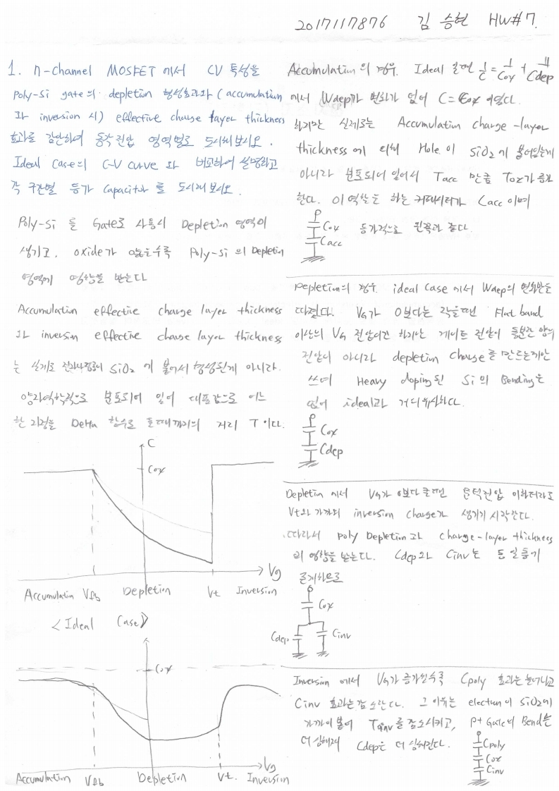

# HW7

> 전자소자 (김학린)HW#7 (04/06, 월요일) - (제출마감일 : 4/12 일요일)이전 HW들은 수강 정정 기간 학생들을 고려하여 HW 제출 기한이다소 여유 있게 잡혀 있었습니다만,향후 HW들은 1주일 이내 제출로 본부 가이드를 따르니 제출 기한에 유의 바랍니다.

1. n-channel MOSFET에서 C-V 특성을 poly-Si gate의 depletion 형성 효과와

(accumulation과 inversion 시) effective charge layer thickness 효과를 감안하여

동작전압 영역 별로 도시해 보시오. Ideal case의 C-V curve와 비교하여 설명하고,

각 구간별 등가 capacitor를 도시해 보시오.

