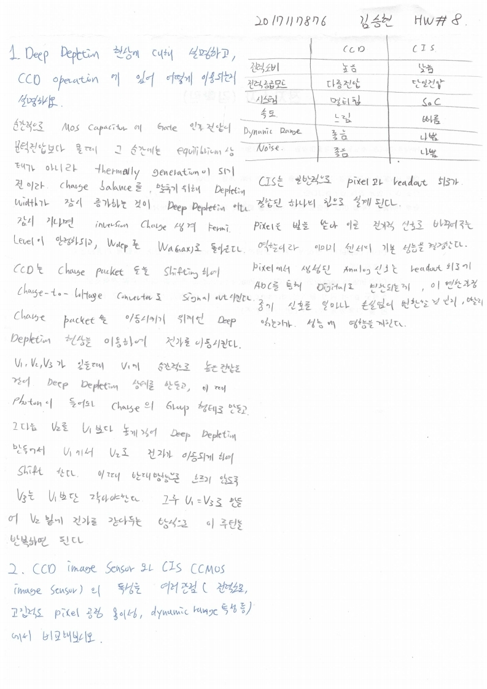

# HW8

> 전자소자 (김학린)HW#8 (04/08, 수요일) - (제출마감일 : 4/14 화요일)이전 HW들은 수강 정정 기간 학생들을 고려하여 HW 제출 기한이다소 여유 있게 잡혀 있었습니다만,향후 HW들은 1주일 이내 제출로 본부 가이드를 따르니 제출 기한에 유의 바랍니다.

1. Deep depletion 현상에 대해 설명하고, CCD operation에 있어 어떻게 이용되는지 설명하시오.

2. CCD image sensor와 CIS (CMOS image sensor)의 특성을 여러 관점(전력소모, 고 집적도 pixel 공정 용이성, dynamic range 특성... 등)에서 비교해 보시오. (강의게시판 및 단톡방에 게시한 pdf 내용 참조)

