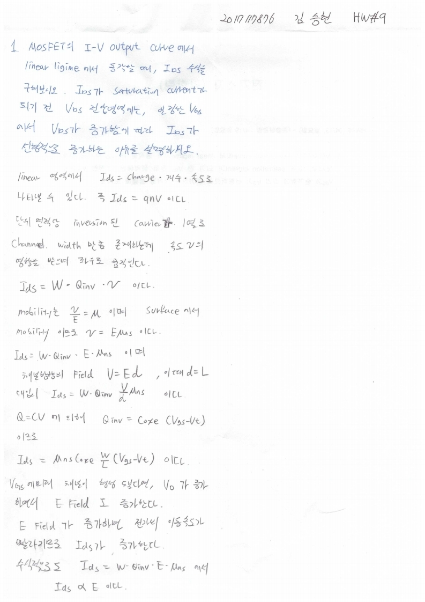

# HW9

전자소자 (김학린)

HW#9 (04/13, 월요일) - (제출마감일 : 4/19 일요일)

1. MOSFET의 I-V output curve에서 linear regime에서 동작할 때, IDS 수식을 구해보시오. IDS가 saturation current가 되기 전 VDS 전압 영역에는, 일정한 VGS에서 VDS가 증가함에 따라 IDS가 선형적으로 증가하는 이유를 설명해 보시오.

